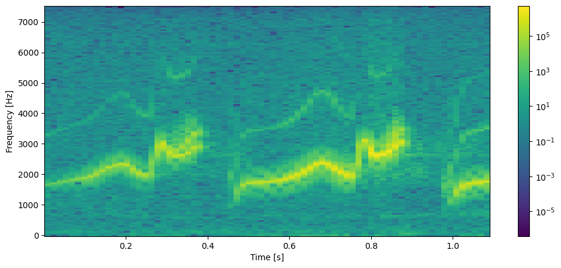
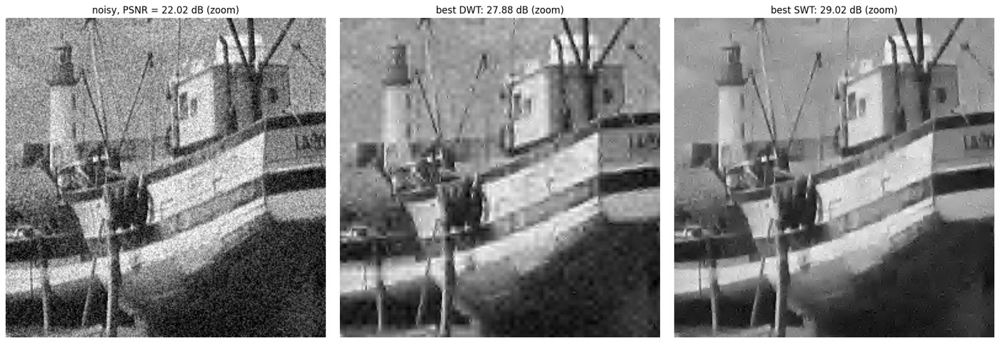
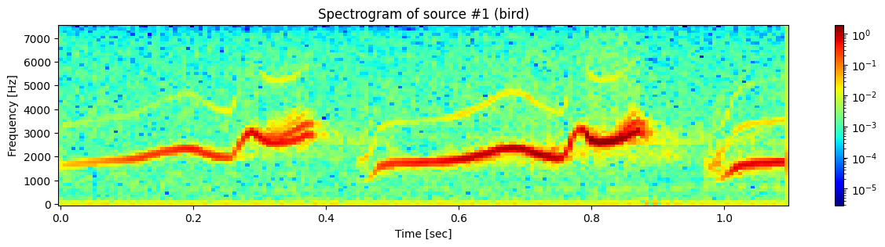
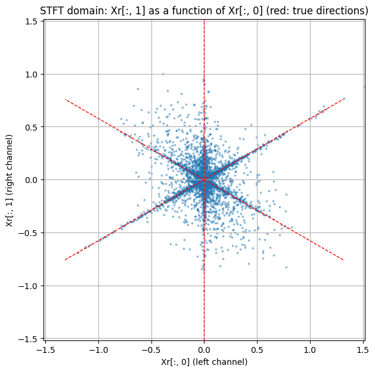
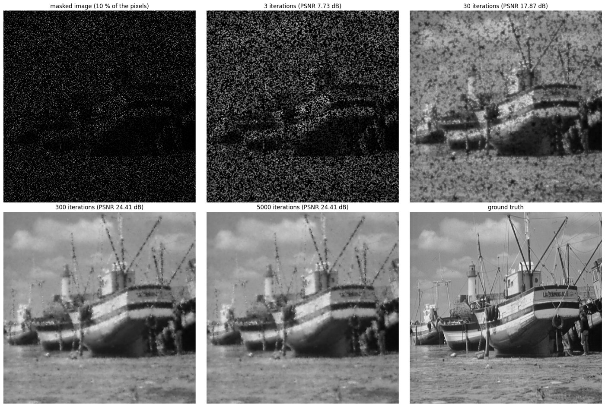

# Signal Representations and Inverse Problems

Jupyter notebooks covering time-frequency analysis, wavelets, sparse source separation, and gradient-based methods for inverse problems.

This repository contains four practical sessions from the **Signal Representations and Inverse Problems** course at Centrale Lille (groups G1–G2). The notebooks, explanations, figures, and answers are written in English.



## Contents

| Lab | Topic | Main concepts |
| --- | --- | --- |
| [Lab 1](lab1/lab1.ipynb) | Time-frequency analysis | Fourier transform, windowing, STFT, spectrograms, time-frequency resolution trade-off |
| [Lab 2](lab2/lab2.ipynb) | Wavelets and image processing | DWT/SWT, multiresolution analysis, 2D coefficients, thresholding, denoising |
| [Lab 3](lab3/lab3.ipynb) | Sparse source separation | time-frequency sparsity, mixing-direction estimation, binary masks, ISTFT |
| [Lab 4](lab4/lab4.ipynb) | Optimisation and inverse problems | gradient descent, adjoint operators, Tikhonov regularisation, inpainting, projection |

## Key results

- **Lab 1:** analysis of the time-frequency resolution trade-off and separation of two sinusoids only 20 Hz apart using a 1,024-sample Hann window.
- **Lab 2:** PSNR of 22.0 dB for the noisy image, 27.9 dB after DWT denoising, and 29.0 dB with the stationary wavelet transform.
- **Lab 3:** 93.5% of the significant time-frequency coefficients correctly assigned, with three sources separated from only two mixtures.
- **Lab 4:** approximately 29.5 dB for the best tested Tikhonov denoising parameter and 24.4 dB for inpainting from 10% of the pixels.

## Installation

The reference environment uses **Python 3.12**.

```bash
git clone https://github.com/ugo-roccamatisi/signal-representations-and-inverse-problems.git
cd signal-representations-and-inverse-problems

python -m venv .venv
source .venv/bin/activate      # Linux or macOS
# .venv\Scripts\activate       # Windows PowerShell

python -m pip install --upgrade pip
python -m pip install -r requirements.txt
```

The exact package versions used to verify all four notebooks are pinned in [`requirements.txt`](requirements.txt).

## Running the notebooks

Each lab is self-contained. Open a notebook from its own directory so that its relative paths to images and audio files remain valid.

```bash
cd lab1
jupyter notebook lab1.ipynb
```

In Jupyter, select **Kernel → Restart Kernel and Run All Cells**.

The parameter searches in Lab 2 and the 5,000 iterations in Lab 4 are the most time-consuming computations. Audio playback uses `IPython.display.Audio`, so executing the notebooks does not require Python to access a system audio device.

## Repository structure

```text
.
├── lab1/                 # Fourier analysis, STFT, and spectrograms
│   ├── lab1.ipynb
│   ├── module_TDS.py
│   ├── signal_2sinus.mat
│   └── sounds/
├── lab2/                 # Wavelets and image processing
│   ├── lab2.ipynb
│   ├── img/
│   └── lib/
├── lab3/                 # Sparse source separation
│   ├── lab3.ipynb
│   └── nt_toolbox/
├── lab4/                 # Gradient descent, denoising, and inpainting
│   ├── lab4.ipynb
│   └── img/
└── requirements.txt
```

## Reproducibility

- All four notebooks include their outputs and execute sequentially without errors.
- Random experiments use fixed seeds.
- Paths are relative to each lab directory.
- WAV files were normalised to remove warnings caused by non-audio chunks.
- Parameters selected by maximising PSNR in Lab 2 are explicitly identified as **oracle settings**, because they use the clean reference image.

## Gallery

| | |
|---|---|
|  |  |
|  |  |

## Provenance

The notebooks were reconstructed from the original lab reports, then rewritten and verified using the figures and numerical values generated from the resources in this repository.

Some original course files were unavailable: the two Lab 1 music recordings and `signal_2sinus.mat` are synthetic substitutes, and `module_TDS.py`, `plotwavelet.py` and `nt_toolbox/` are rewritten versions of the course modules. The Boat image comes from the USC-SIPI database.

## Academic use

This repository is intended as a learning and reproducibility resource. Before publicly distributing course material, data, or third-party assets, check the institution's publication rules and the rights associated with each resource.

## License

No license is included by default because the repository contains course resources and data that may be governed by different terms. Add a license only after confirming which materials you are allowed to redistribute.

Part of my [portfolio](https://ugo-roccamatisi.github.io).
